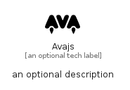

# Avajs


```text
simpleicons/A/Avajs
```

```text
include('simpleicons/A/Avajs')
```


| Illustration | Avajs |
| :---: | :---: |
|  |  |


## Sprites
The item provides the following sriptes:

- `<$AvajsXs>`
- `<$AvajsSm>`
- `<$AvajsMd>`
- `<$AvajsLg>`


## Avajs

### Load remotely
```plantuml
@startuml
' configures the library
!global $LIB_BASE_LOCATION="https://raw.githubusercontent.com/tmorin/plantuml-libs/master/distribution"

' loads the library's bootstrap
!include $LIB_BASE_LOCATION/bootstrap.puml

' loads the package bootstrap
include('simpleicons/bootstrap')

' loads the Item which embeds the element Avajs
include('simpleicons/A/Avajs')

' renders the element
Avajs('Avajs', 'Avajs', 'an optional tech label', 'an optional description')
@enduml
```

### Load locally
```plantuml
@startuml
' configures the library
!global $INCLUSION_MODE="local"
!global $LIB_BASE_LOCATION="../.."

' loads the library's bootstrap
!include $LIB_BASE_LOCATION/bootstrap.puml

' loads the package bootstrap
include('simpleicons/bootstrap')

' loads the Item which embeds the element Avajs
include('simpleicons/A/Avajs')

' renders the element
Avajs('Avajs', 'Avajs', 'an optional tech label', 'an optional description')
@enduml
```

