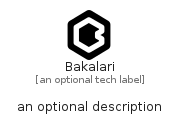

# Bakalari


```text
simpleicons/B/Bakalari
```

```text
include('simpleicons/B/Bakalari')
```


| Illustration | Bakalari |
| :---: | :---: |
|  |  |


## Sprites
The item provides the following sriptes:

- `<$BakalariXs>`
- `<$BakalariSm>`
- `<$BakalariMd>`
- `<$BakalariLg>`


## Bakalari

### Load remotely
```plantuml
@startuml
' configures the library
!global $LIB_BASE_LOCATION="https://raw.githubusercontent.com/tmorin/plantuml-libs/master/distribution"

' loads the library's bootstrap
!include $LIB_BASE_LOCATION/bootstrap.puml

' loads the package bootstrap
include('simpleicons/bootstrap')

' loads the Item which embeds the element Bakalari
include('simpleicons/B/Bakalari')

' renders the element
Bakalari('Bakalari', 'Bakalari', 'an optional tech label', 'an optional description')
@enduml
```

### Load locally
```plantuml
@startuml
' configures the library
!global $INCLUSION_MODE="local"
!global $LIB_BASE_LOCATION="../.."

' loads the library's bootstrap
!include $LIB_BASE_LOCATION/bootstrap.puml

' loads the package bootstrap
include('simpleicons/bootstrap')

' loads the Item which embeds the element Bakalari
include('simpleicons/B/Bakalari')

' renders the element
Bakalari('Bakalari', 'Bakalari', 'an optional tech label', 'an optional description')
@enduml
```

