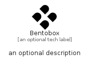

# Bentobox


```text
simpleicons/B/Bentobox
```

```text
include('simpleicons/B/Bentobox')
```


| Illustration | Bentobox |
| :---: | :---: |
|  |  |


## Sprites
The item provides the following sriptes:

- `<$BentoboxXs>`
- `<$BentoboxSm>`
- `<$BentoboxMd>`
- `<$BentoboxLg>`


## Bentobox

### Load remotely
```plantuml
@startuml
' configures the library
!global $LIB_BASE_LOCATION="https://raw.githubusercontent.com/tmorin/plantuml-libs/master/distribution"

' loads the library's bootstrap
!include $LIB_BASE_LOCATION/bootstrap.puml

' loads the package bootstrap
include('simpleicons/bootstrap')

' loads the Item which embeds the element Bentobox
include('simpleicons/B/Bentobox')

' renders the element
Bentobox('Bentobox', 'Bentobox', 'an optional tech label', 'an optional description')
@enduml
```

### Load locally
```plantuml
@startuml
' configures the library
!global $INCLUSION_MODE="local"
!global $LIB_BASE_LOCATION="../.."

' loads the library's bootstrap
!include $LIB_BASE_LOCATION/bootstrap.puml

' loads the package bootstrap
include('simpleicons/bootstrap')

' loads the Item which embeds the element Bentobox
include('simpleicons/B/Bentobox')

' renders the element
Bentobox('Bentobox', 'Bentobox', 'an optional tech label', 'an optional description')
@enduml
```

