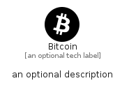

# Bitcoin


```text
simpleicons/B/Bitcoin
```

```text
include('simpleicons/B/Bitcoin')
```


| Illustration | Bitcoin |
| :---: | :---: |
|  |  |


## Sprites
The item provides the following sriptes:

- `<$BitcoinXs>`
- `<$BitcoinSm>`
- `<$BitcoinMd>`
- `<$BitcoinLg>`


## Bitcoin

### Load remotely
```plantuml
@startuml
' configures the library
!global $LIB_BASE_LOCATION="https://raw.githubusercontent.com/tmorin/plantuml-libs/master/distribution"

' loads the library's bootstrap
!include $LIB_BASE_LOCATION/bootstrap.puml

' loads the package bootstrap
include('simpleicons/bootstrap')

' loads the Item which embeds the element Bitcoin
include('simpleicons/B/Bitcoin')

' renders the element
Bitcoin('Bitcoin', 'Bitcoin', 'an optional tech label', 'an optional description')
@enduml
```

### Load locally
```plantuml
@startuml
' configures the library
!global $INCLUSION_MODE="local"
!global $LIB_BASE_LOCATION="../.."

' loads the library's bootstrap
!include $LIB_BASE_LOCATION/bootstrap.puml

' loads the package bootstrap
include('simpleicons/bootstrap')

' loads the Item which embeds the element Bitcoin
include('simpleicons/B/Bitcoin')

' renders the element
Bitcoin('Bitcoin', 'Bitcoin', 'an optional tech label', 'an optional description')
@enduml
```

