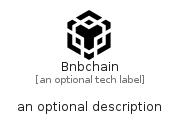

# Bnbchain


```text
simpleicons/B/Bnbchain
```

```text
include('simpleicons/B/Bnbchain')
```


| Illustration | Bnbchain |
| :---: | :---: |
|  |  |


## Sprites
The item provides the following sriptes:

- `<$BnbchainXs>`
- `<$BnbchainSm>`
- `<$BnbchainMd>`
- `<$BnbchainLg>`


## Bnbchain

### Load remotely
```plantuml
@startuml
' configures the library
!global $LIB_BASE_LOCATION="https://raw.githubusercontent.com/tmorin/plantuml-libs/master/distribution"

' loads the library's bootstrap
!include $LIB_BASE_LOCATION/bootstrap.puml

' loads the package bootstrap
include('simpleicons/bootstrap')

' loads the Item which embeds the element Bnbchain
include('simpleicons/B/Bnbchain')

' renders the element
Bnbchain('Bnbchain', 'Bnbchain', 'an optional tech label', 'an optional description')
@enduml
```

### Load locally
```plantuml
@startuml
' configures the library
!global $INCLUSION_MODE="local"
!global $LIB_BASE_LOCATION="../.."

' loads the library's bootstrap
!include $LIB_BASE_LOCATION/bootstrap.puml

' loads the package bootstrap
include('simpleicons/bootstrap')

' loads the Item which embeds the element Bnbchain
include('simpleicons/B/Bnbchain')

' renders the element
Bnbchain('Bnbchain', 'Bnbchain', 'an optional tech label', 'an optional description')
@enduml
```

