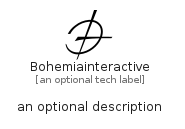

# Bohemiainteractive


```text
simpleicons/B/Bohemiainteractive
```

```text
include('simpleicons/B/Bohemiainteractive')
```


| Illustration | Bohemiainteractive |
| :---: | :---: |
|  |  |


## Sprites
The item provides the following sriptes:

- `<$BohemiainteractiveXs>`
- `<$BohemiainteractiveSm>`
- `<$BohemiainteractiveMd>`
- `<$BohemiainteractiveLg>`


## Bohemiainteractive

### Load remotely
```plantuml
@startuml
' configures the library
!global $LIB_BASE_LOCATION="https://raw.githubusercontent.com/tmorin/plantuml-libs/master/distribution"

' loads the library's bootstrap
!include $LIB_BASE_LOCATION/bootstrap.puml

' loads the package bootstrap
include('simpleicons/bootstrap')

' loads the Item which embeds the element Bohemiainteractive
include('simpleicons/B/Bohemiainteractive')

' renders the element
Bohemiainteractive('Bohemiainteractive', 'Bohemiainteractive', 'an optional tech label', 'an optional description')
@enduml
```

### Load locally
```plantuml
@startuml
' configures the library
!global $INCLUSION_MODE="local"
!global $LIB_BASE_LOCATION="../.."

' loads the library's bootstrap
!include $LIB_BASE_LOCATION/bootstrap.puml

' loads the package bootstrap
include('simpleicons/bootstrap')

' loads the Item which embeds the element Bohemiainteractive
include('simpleicons/B/Bohemiainteractive')

' renders the element
Bohemiainteractive('Bohemiainteractive', 'Bohemiainteractive', 'an optional tech label', 'an optional description')
@enduml
```

