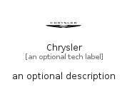

# Chrysler


```text
simpleicons/C/Chrysler
```

```text
include('simpleicons/C/Chrysler')
```


| Illustration | Chrysler |
| :---: | :---: |
|  |  |


## Sprites
The item provides the following sriptes:

- `<$ChryslerXs>`
- `<$ChryslerSm>`
- `<$ChryslerMd>`
- `<$ChryslerLg>`


## Chrysler

### Load remotely
```plantuml
@startuml
' configures the library
!global $LIB_BASE_LOCATION="https://raw.githubusercontent.com/tmorin/plantuml-libs/master/distribution"

' loads the library's bootstrap
!include $LIB_BASE_LOCATION/bootstrap.puml

' loads the package bootstrap
include('simpleicons/bootstrap')

' loads the Item which embeds the element Chrysler
include('simpleicons/C/Chrysler')

' renders the element
Chrysler('Chrysler', 'Chrysler', 'an optional tech label', 'an optional description')
@enduml
```

### Load locally
```plantuml
@startuml
' configures the library
!global $INCLUSION_MODE="local"
!global $LIB_BASE_LOCATION="../.."

' loads the library's bootstrap
!include $LIB_BASE_LOCATION/bootstrap.puml

' loads the package bootstrap
include('simpleicons/bootstrap')

' loads the Item which embeds the element Chrysler
include('simpleicons/C/Chrysler')

' renders the element
Chrysler('Chrysler', 'Chrysler', 'an optional tech label', 'an optional description')
@enduml
```

