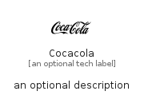

# Cocacola


```text
simpleicons/C/Cocacola
```

```text
include('simpleicons/C/Cocacola')
```


| Illustration | Cocacola |
| :---: | :---: |
|  |  |


## Sprites
The item provides the following sriptes:

- `<$CocacolaXs>`
- `<$CocacolaSm>`
- `<$CocacolaMd>`
- `<$CocacolaLg>`


## Cocacola

### Load remotely
```plantuml
@startuml
' configures the library
!global $LIB_BASE_LOCATION="https://raw.githubusercontent.com/tmorin/plantuml-libs/master/distribution"

' loads the library's bootstrap
!include $LIB_BASE_LOCATION/bootstrap.puml

' loads the package bootstrap
include('simpleicons/bootstrap')

' loads the Item which embeds the element Cocacola
include('simpleicons/C/Cocacola')

' renders the element
Cocacola('Cocacola', 'Cocacola', 'an optional tech label', 'an optional description')
@enduml
```

### Load locally
```plantuml
@startuml
' configures the library
!global $INCLUSION_MODE="local"
!global $LIB_BASE_LOCATION="../.."

' loads the library's bootstrap
!include $LIB_BASE_LOCATION/bootstrap.puml

' loads the package bootstrap
include('simpleicons/bootstrap')

' loads the Item which embeds the element Cocacola
include('simpleicons/C/Cocacola')

' renders the element
Cocacola('Cocacola', 'Cocacola', 'an optional tech label', 'an optional description')
@enduml
```

