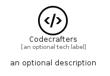

# Codecrafters


```text
simpleicons/C/Codecrafters
```

```text
include('simpleicons/C/Codecrafters')
```


| Illustration | Codecrafters |
| :---: | :---: |
|  |  |


## Sprites
The item provides the following sriptes:

- `<$CodecraftersXs>`
- `<$CodecraftersSm>`
- `<$CodecraftersMd>`
- `<$CodecraftersLg>`


## Codecrafters

### Load remotely
```plantuml
@startuml
' configures the library
!global $LIB_BASE_LOCATION="https://raw.githubusercontent.com/tmorin/plantuml-libs/master/distribution"

' loads the library's bootstrap
!include $LIB_BASE_LOCATION/bootstrap.puml

' loads the package bootstrap
include('simpleicons/bootstrap')

' loads the Item which embeds the element Codecrafters
include('simpleicons/C/Codecrafters')

' renders the element
Codecrafters('Codecrafters', 'Codecrafters', 'an optional tech label', 'an optional description')
@enduml
```

### Load locally
```plantuml
@startuml
' configures the library
!global $INCLUSION_MODE="local"
!global $LIB_BASE_LOCATION="../.."

' loads the library's bootstrap
!include $LIB_BASE_LOCATION/bootstrap.puml

' loads the package bootstrap
include('simpleicons/bootstrap')

' loads the Item which embeds the element Codecrafters
include('simpleicons/C/Codecrafters')

' renders the element
Codecrafters('Codecrafters', 'Codecrafters', 'an optional tech label', 'an optional description')
@enduml
```

