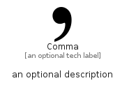

# Comma


```text
simpleicons/C/Comma
```

```text
include('simpleicons/C/Comma')
```


| Illustration | Comma |
| :---: | :---: |
|  |  |


## Sprites
The item provides the following sriptes:

- `<$CommaXs>`
- `<$CommaSm>`
- `<$CommaMd>`
- `<$CommaLg>`


## Comma

### Load remotely
```plantuml
@startuml
' configures the library
!global $LIB_BASE_LOCATION="https://raw.githubusercontent.com/tmorin/plantuml-libs/master/distribution"

' loads the library's bootstrap
!include $LIB_BASE_LOCATION/bootstrap.puml

' loads the package bootstrap
include('simpleicons/bootstrap')

' loads the Item which embeds the element Comma
include('simpleicons/C/Comma')

' renders the element
Comma('Comma', 'Comma', 'an optional tech label', 'an optional description')
@enduml
```

### Load locally
```plantuml
@startuml
' configures the library
!global $INCLUSION_MODE="local"
!global $LIB_BASE_LOCATION="../.."

' loads the library's bootstrap
!include $LIB_BASE_LOCATION/bootstrap.puml

' loads the package bootstrap
include('simpleicons/bootstrap')

' loads the Item which embeds the element Comma
include('simpleicons/C/Comma')

' renders the element
Comma('Comma', 'Comma', 'an optional tech label', 'an optional description')
@enduml
```

