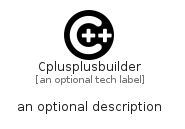

# Cplusplusbuilder


```text
simpleicons/C/Cplusplusbuilder
```

```text
include('simpleicons/C/Cplusplusbuilder')
```


| Illustration | Cplusplusbuilder |
| :---: | :---: |
|  |  |


## Sprites
The item provides the following sriptes:

- `<$CplusplusbuilderXs>`
- `<$CplusplusbuilderSm>`
- `<$CplusplusbuilderMd>`
- `<$CplusplusbuilderLg>`


## Cplusplusbuilder

### Load remotely
```plantuml
@startuml
' configures the library
!global $LIB_BASE_LOCATION="https://raw.githubusercontent.com/tmorin/plantuml-libs/master/distribution"

' loads the library's bootstrap
!include $LIB_BASE_LOCATION/bootstrap.puml

' loads the package bootstrap
include('simpleicons/bootstrap')

' loads the Item which embeds the element Cplusplusbuilder
include('simpleicons/C/Cplusplusbuilder')

' renders the element
Cplusplusbuilder('Cplusplusbuilder', 'Cplusplusbuilder', 'an optional tech label', 'an optional description')
@enduml
```

### Load locally
```plantuml
@startuml
' configures the library
!global $INCLUSION_MODE="local"
!global $LIB_BASE_LOCATION="../.."

' loads the library's bootstrap
!include $LIB_BASE_LOCATION/bootstrap.puml

' loads the package bootstrap
include('simpleicons/bootstrap')

' loads the Item which embeds the element Cplusplusbuilder
include('simpleicons/C/Cplusplusbuilder')

' renders the element
Cplusplusbuilder('Cplusplusbuilder', 'Cplusplusbuilder', 'an optional tech label', 'an optional description')
@enduml
```

