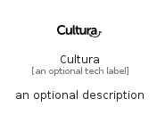

# Cultura


```text
simpleicons/C/Cultura
```

```text
include('simpleicons/C/Cultura')
```


| Illustration | Cultura |
| :---: | :---: |
|  |  |


## Sprites
The item provides the following sriptes:

- `<$CulturaXs>`
- `<$CulturaSm>`
- `<$CulturaMd>`
- `<$CulturaLg>`


## Cultura

### Load remotely
```plantuml
@startuml
' configures the library
!global $LIB_BASE_LOCATION="https://raw.githubusercontent.com/tmorin/plantuml-libs/master/distribution"

' loads the library's bootstrap
!include $LIB_BASE_LOCATION/bootstrap.puml

' loads the package bootstrap
include('simpleicons/bootstrap')

' loads the Item which embeds the element Cultura
include('simpleicons/C/Cultura')

' renders the element
Cultura('Cultura', 'Cultura', 'an optional tech label', 'an optional description')
@enduml
```

### Load locally
```plantuml
@startuml
' configures the library
!global $INCLUSION_MODE="local"
!global $LIB_BASE_LOCATION="../.."

' loads the library's bootstrap
!include $LIB_BASE_LOCATION/bootstrap.puml

' loads the package bootstrap
include('simpleicons/bootstrap')

' loads the Item which embeds the element Cultura
include('simpleicons/C/Cultura')

' renders the element
Cultura('Cultura', 'Cultura', 'an optional tech label', 'an optional description')
@enduml
```

