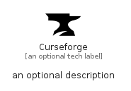

# Curseforge


```text
simpleicons/C/Curseforge
```

```text
include('simpleicons/C/Curseforge')
```


| Illustration | Curseforge |
| :---: | :---: |
|  |  |


## Sprites
The item provides the following sriptes:

- `<$CurseforgeXs>`
- `<$CurseforgeSm>`
- `<$CurseforgeMd>`
- `<$CurseforgeLg>`


## Curseforge

### Load remotely
```plantuml
@startuml
' configures the library
!global $LIB_BASE_LOCATION="https://raw.githubusercontent.com/tmorin/plantuml-libs/master/distribution"

' loads the library's bootstrap
!include $LIB_BASE_LOCATION/bootstrap.puml

' loads the package bootstrap
include('simpleicons/bootstrap')

' loads the Item which embeds the element Curseforge
include('simpleicons/C/Curseforge')

' renders the element
Curseforge('Curseforge', 'Curseforge', 'an optional tech label', 'an optional description')
@enduml
```

### Load locally
```plantuml
@startuml
' configures the library
!global $INCLUSION_MODE="local"
!global $LIB_BASE_LOCATION="../.."

' loads the library's bootstrap
!include $LIB_BASE_LOCATION/bootstrap.puml

' loads the package bootstrap
include('simpleicons/bootstrap')

' loads the Item which embeds the element Curseforge
include('simpleicons/C/Curseforge')

' renders the element
Curseforge('Curseforge', 'Curseforge', 'an optional tech label', 'an optional description')
@enduml
```

