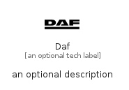

# Daf


```text
simpleicons/D/Daf
```

```text
include('simpleicons/D/Daf')
```


| Illustration | Daf |
| :---: | :---: |
|  |  |


## Sprites
The item provides the following sriptes:

- `<$DafXs>`
- `<$DafSm>`
- `<$DafMd>`
- `<$DafLg>`


## Daf

### Load remotely
```plantuml
@startuml
' configures the library
!global $LIB_BASE_LOCATION="https://raw.githubusercontent.com/tmorin/plantuml-libs/master/distribution"

' loads the library's bootstrap
!include $LIB_BASE_LOCATION/bootstrap.puml

' loads the package bootstrap
include('simpleicons/bootstrap')

' loads the Item which embeds the element Daf
include('simpleicons/D/Daf')

' renders the element
Daf('Daf', 'Daf', 'an optional tech label', 'an optional description')
@enduml
```

### Load locally
```plantuml
@startuml
' configures the library
!global $INCLUSION_MODE="local"
!global $LIB_BASE_LOCATION="../.."

' loads the library's bootstrap
!include $LIB_BASE_LOCATION/bootstrap.puml

' loads the package bootstrap
include('simpleicons/bootstrap')

' loads the Item which embeds the element Daf
include('simpleicons/D/Daf')

' renders the element
Daf('Daf', 'Daf', 'an optional tech label', 'an optional description')
@enduml
```

