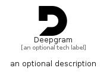

# Deepgram


```text
simpleicons/D/Deepgram
```

```text
include('simpleicons/D/Deepgram')
```


| Illustration | Deepgram |
| :---: | :---: |
|  |  |


## Sprites
The item provides the following sriptes:

- `<$DeepgramXs>`
- `<$DeepgramSm>`
- `<$DeepgramMd>`
- `<$DeepgramLg>`


## Deepgram

### Load remotely
```plantuml
@startuml
' configures the library
!global $LIB_BASE_LOCATION="https://raw.githubusercontent.com/tmorin/plantuml-libs/master/distribution"

' loads the library's bootstrap
!include $LIB_BASE_LOCATION/bootstrap.puml

' loads the package bootstrap
include('simpleicons/bootstrap')

' loads the Item which embeds the element Deepgram
include('simpleicons/D/Deepgram')

' renders the element
Deepgram('Deepgram', 'Deepgram', 'an optional tech label', 'an optional description')
@enduml
```

### Load locally
```plantuml
@startuml
' configures the library
!global $INCLUSION_MODE="local"
!global $LIB_BASE_LOCATION="../.."

' loads the library's bootstrap
!include $LIB_BASE_LOCATION/bootstrap.puml

' loads the package bootstrap
include('simpleicons/bootstrap')

' loads the Item which embeds the element Deepgram
include('simpleicons/D/Deepgram')

' renders the element
Deepgram('Deepgram', 'Deepgram', 'an optional tech label', 'an optional description')
@enduml
```

