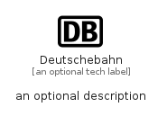

# Deutschebahn


```text
simpleicons/D/Deutschebahn
```

```text
include('simpleicons/D/Deutschebahn')
```


| Illustration | Deutschebahn |
| :---: | :---: |
|  |  |


## Sprites
The item provides the following sriptes:

- `<$DeutschebahnXs>`
- `<$DeutschebahnSm>`
- `<$DeutschebahnMd>`
- `<$DeutschebahnLg>`


## Deutschebahn

### Load remotely
```plantuml
@startuml
' configures the library
!global $LIB_BASE_LOCATION="https://raw.githubusercontent.com/tmorin/plantuml-libs/master/distribution"

' loads the library's bootstrap
!include $LIB_BASE_LOCATION/bootstrap.puml

' loads the package bootstrap
include('simpleicons/bootstrap')

' loads the Item which embeds the element Deutschebahn
include('simpleicons/D/Deutschebahn')

' renders the element
Deutschebahn('Deutschebahn', 'Deutschebahn', 'an optional tech label', 'an optional description')
@enduml
```

### Load locally
```plantuml
@startuml
' configures the library
!global $INCLUSION_MODE="local"
!global $LIB_BASE_LOCATION="../.."

' loads the library's bootstrap
!include $LIB_BASE_LOCATION/bootstrap.puml

' loads the package bootstrap
include('simpleicons/bootstrap')

' loads the Item which embeds the element Deutschebahn
include('simpleicons/D/Deutschebahn')

' renders the element
Deutschebahn('Deutschebahn', 'Deutschebahn', 'an optional tech label', 'an optional description')
@enduml
```

