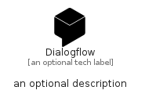

# Dialogflow


```text
simpleicons/D/Dialogflow
```

```text
include('simpleicons/D/Dialogflow')
```


| Illustration | Dialogflow |
| :---: | :---: |
|  |  |


## Sprites
The item provides the following sriptes:

- `<$DialogflowXs>`
- `<$DialogflowSm>`
- `<$DialogflowMd>`
- `<$DialogflowLg>`


## Dialogflow

### Load remotely
```plantuml
@startuml
' configures the library
!global $LIB_BASE_LOCATION="https://raw.githubusercontent.com/tmorin/plantuml-libs/master/distribution"

' loads the library's bootstrap
!include $LIB_BASE_LOCATION/bootstrap.puml

' loads the package bootstrap
include('simpleicons/bootstrap')

' loads the Item which embeds the element Dialogflow
include('simpleicons/D/Dialogflow')

' renders the element
Dialogflow('Dialogflow', 'Dialogflow', 'an optional tech label', 'an optional description')
@enduml
```

### Load locally
```plantuml
@startuml
' configures the library
!global $INCLUSION_MODE="local"
!global $LIB_BASE_LOCATION="../.."

' loads the library's bootstrap
!include $LIB_BASE_LOCATION/bootstrap.puml

' loads the package bootstrap
include('simpleicons/bootstrap')

' loads the Item which embeds the element Dialogflow
include('simpleicons/D/Dialogflow')

' renders the element
Dialogflow('Dialogflow', 'Dialogflow', 'an optional tech label', 'an optional description')
@enduml
```

