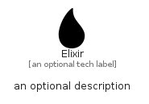

# Elixir


```text
simpleicons/E/Elixir
```

```text
include('simpleicons/E/Elixir')
```


| Illustration | Elixir |
| :---: | :---: |
|  |  |


## Sprites
The item provides the following sriptes:

- `<$ElixirXs>`
- `<$ElixirSm>`
- `<$ElixirMd>`
- `<$ElixirLg>`


## Elixir

### Load remotely
```plantuml
@startuml
' configures the library
!global $LIB_BASE_LOCATION="https://raw.githubusercontent.com/tmorin/plantuml-libs/master/distribution"

' loads the library's bootstrap
!include $LIB_BASE_LOCATION/bootstrap.puml

' loads the package bootstrap
include('simpleicons/bootstrap')

' loads the Item which embeds the element Elixir
include('simpleicons/E/Elixir')

' renders the element
Elixir('Elixir', 'Elixir', 'an optional tech label', 'an optional description')
@enduml
```

### Load locally
```plantuml
@startuml
' configures the library
!global $INCLUSION_MODE="local"
!global $LIB_BASE_LOCATION="../.."

' loads the library's bootstrap
!include $LIB_BASE_LOCATION/bootstrap.puml

' loads the package bootstrap
include('simpleicons/bootstrap')

' loads the Item which embeds the element Elixir
include('simpleicons/E/Elixir')

' renders the element
Elixir('Elixir', 'Elixir', 'an optional tech label', 'an optional description')
@enduml
```

