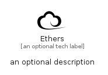

# Ethers


```text
simpleicons/E/Ethers
```

```text
include('simpleicons/E/Ethers')
```


| Illustration | Ethers |
| :---: | :---: |
|  |  |


## Sprites
The item provides the following sriptes:

- `<$EthersXs>`
- `<$EthersSm>`
- `<$EthersMd>`
- `<$EthersLg>`


## Ethers

### Load remotely
```plantuml
@startuml
' configures the library
!global $LIB_BASE_LOCATION="https://raw.githubusercontent.com/tmorin/plantuml-libs/master/distribution"

' loads the library's bootstrap
!include $LIB_BASE_LOCATION/bootstrap.puml

' loads the package bootstrap
include('simpleicons/bootstrap')

' loads the Item which embeds the element Ethers
include('simpleicons/E/Ethers')

' renders the element
Ethers('Ethers', 'Ethers', 'an optional tech label', 'an optional description')
@enduml
```

### Load locally
```plantuml
@startuml
' configures the library
!global $INCLUSION_MODE="local"
!global $LIB_BASE_LOCATION="../.."

' loads the library's bootstrap
!include $LIB_BASE_LOCATION/bootstrap.puml

' loads the package bootstrap
include('simpleicons/bootstrap')

' loads the Item which embeds the element Ethers
include('simpleicons/E/Ethers')

' renders the element
Ethers('Ethers', 'Ethers', 'an optional tech label', 'an optional description')
@enduml
```

