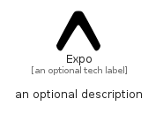

# Expo


```text
simpleicons/E/Expo
```

```text
include('simpleicons/E/Expo')
```


| Illustration | Expo |
| :---: | :---: |
|  |  |


## Sprites
The item provides the following sriptes:

- `<$ExpoXs>`
- `<$ExpoSm>`
- `<$ExpoMd>`
- `<$ExpoLg>`


## Expo

### Load remotely
```plantuml
@startuml
' configures the library
!global $LIB_BASE_LOCATION="https://raw.githubusercontent.com/tmorin/plantuml-libs/master/distribution"

' loads the library's bootstrap
!include $LIB_BASE_LOCATION/bootstrap.puml

' loads the package bootstrap
include('simpleicons/bootstrap')

' loads the Item which embeds the element Expo
include('simpleicons/E/Expo')

' renders the element
Expo('Expo', 'Expo', 'an optional tech label', 'an optional description')
@enduml
```

### Load locally
```plantuml
@startuml
' configures the library
!global $INCLUSION_MODE="local"
!global $LIB_BASE_LOCATION="../.."

' loads the library's bootstrap
!include $LIB_BASE_LOCATION/bootstrap.puml

' loads the package bootstrap
include('simpleicons/bootstrap')

' loads the Item which embeds the element Expo
include('simpleicons/E/Expo')

' renders the element
Expo('Expo', 'Expo', 'an optional tech label', 'an optional description')
@enduml
```

