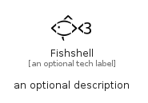

# Fishshell


```text
simpleicons/F/Fishshell
```

```text
include('simpleicons/F/Fishshell')
```


| Illustration | Fishshell |
| :---: | :---: |
|  |  |


## Sprites
The item provides the following sriptes:

- `<$FishshellXs>`
- `<$FishshellSm>`
- `<$FishshellMd>`
- `<$FishshellLg>`


## Fishshell

### Load remotely
```plantuml
@startuml
' configures the library
!global $LIB_BASE_LOCATION="https://raw.githubusercontent.com/tmorin/plantuml-libs/master/distribution"

' loads the library's bootstrap
!include $LIB_BASE_LOCATION/bootstrap.puml

' loads the package bootstrap
include('simpleicons/bootstrap')

' loads the Item which embeds the element Fishshell
include('simpleicons/F/Fishshell')

' renders the element
Fishshell('Fishshell', 'Fishshell', 'an optional tech label', 'an optional description')
@enduml
```

### Load locally
```plantuml
@startuml
' configures the library
!global $INCLUSION_MODE="local"
!global $LIB_BASE_LOCATION="../.."

' loads the library's bootstrap
!include $LIB_BASE_LOCATION/bootstrap.puml

' loads the package bootstrap
include('simpleicons/bootstrap')

' loads the Item which embeds the element Fishshell
include('simpleicons/F/Fishshell')

' renders the element
Fishshell('Fishshell', 'Fishshell', 'an optional tech label', 'an optional description')
@enduml
```

