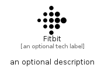

# Fitbit


```text
simpleicons/F/Fitbit
```

```text
include('simpleicons/F/Fitbit')
```


| Illustration | Fitbit |
| :---: | :---: |
|  |  |


## Sprites
The item provides the following sriptes:

- `<$FitbitXs>`
- `<$FitbitSm>`
- `<$FitbitMd>`
- `<$FitbitLg>`


## Fitbit

### Load remotely
```plantuml
@startuml
' configures the library
!global $LIB_BASE_LOCATION="https://raw.githubusercontent.com/tmorin/plantuml-libs/master/distribution"

' loads the library's bootstrap
!include $LIB_BASE_LOCATION/bootstrap.puml

' loads the package bootstrap
include('simpleicons/bootstrap')

' loads the Item which embeds the element Fitbit
include('simpleicons/F/Fitbit')

' renders the element
Fitbit('Fitbit', 'Fitbit', 'an optional tech label', 'an optional description')
@enduml
```

### Load locally
```plantuml
@startuml
' configures the library
!global $INCLUSION_MODE="local"
!global $LIB_BASE_LOCATION="../.."

' loads the library's bootstrap
!include $LIB_BASE_LOCATION/bootstrap.puml

' loads the package bootstrap
include('simpleicons/bootstrap')

' loads the Item which embeds the element Fitbit
include('simpleicons/F/Fitbit')

' renders the element
Fitbit('Fitbit', 'Fitbit', 'an optional tech label', 'an optional description')
@enduml
```

