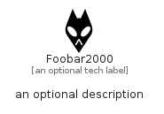

# Foobar2000


```text
simpleicons/F/Foobar2000
```

```text
include('simpleicons/F/Foobar2000')
```


| Illustration | Foobar2000 |
| :---: | :---: |
|  |  |


## Sprites
The item provides the following sriptes:

- `<$Foobar2000Xs>`
- `<$Foobar2000Sm>`
- `<$Foobar2000Md>`
- `<$Foobar2000Lg>`


## Foobar2000

### Load remotely
```plantuml
@startuml
' configures the library
!global $LIB_BASE_LOCATION="https://raw.githubusercontent.com/tmorin/plantuml-libs/master/distribution"

' loads the library's bootstrap
!include $LIB_BASE_LOCATION/bootstrap.puml

' loads the package bootstrap
include('simpleicons/bootstrap')

' loads the Item which embeds the element Foobar2000
include('simpleicons/F/Foobar2000')

' renders the element
Foobar2000('Foobar2000', 'Foobar2000', 'an optional tech label', 'an optional description')
@enduml
```

### Load locally
```plantuml
@startuml
' configures the library
!global $INCLUSION_MODE="local"
!global $LIB_BASE_LOCATION="../.."

' loads the library's bootstrap
!include $LIB_BASE_LOCATION/bootstrap.puml

' loads the package bootstrap
include('simpleicons/bootstrap')

' loads the Item which embeds the element Foobar2000
include('simpleicons/F/Foobar2000')

' renders the element
Foobar2000('Foobar2000', 'Foobar2000', 'an optional tech label', 'an optional description')
@enduml
```

