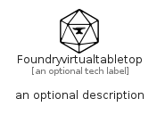

# Foundryvirtualtabletop


```text
simpleicons/F/Foundryvirtualtabletop
```

```text
include('simpleicons/F/Foundryvirtualtabletop')
```


| Illustration | Foundryvirtualtabletop |
| :---: | :---: |
|  |  |


## Sprites
The item provides the following sriptes:

- `<$FoundryvirtualtabletopXs>`
- `<$FoundryvirtualtabletopSm>`
- `<$FoundryvirtualtabletopMd>`
- `<$FoundryvirtualtabletopLg>`


## Foundryvirtualtabletop

### Load remotely
```plantuml
@startuml
' configures the library
!global $LIB_BASE_LOCATION="https://raw.githubusercontent.com/tmorin/plantuml-libs/master/distribution"

' loads the library's bootstrap
!include $LIB_BASE_LOCATION/bootstrap.puml

' loads the package bootstrap
include('simpleicons/bootstrap')

' loads the Item which embeds the element Foundryvirtualtabletop
include('simpleicons/F/Foundryvirtualtabletop')

' renders the element
Foundryvirtualtabletop('Foundryvirtualtabletop', 'Foundryvirtualtabletop', 'an optional tech label', 'an optional description')
@enduml
```

### Load locally
```plantuml
@startuml
' configures the library
!global $INCLUSION_MODE="local"
!global $LIB_BASE_LOCATION="../.."

' loads the library's bootstrap
!include $LIB_BASE_LOCATION/bootstrap.puml

' loads the package bootstrap
include('simpleicons/bootstrap')

' loads the Item which embeds the element Foundryvirtualtabletop
include('simpleicons/F/Foundryvirtualtabletop')

' renders the element
Foundryvirtualtabletop('Foundryvirtualtabletop', 'Foundryvirtualtabletop', 'an optional tech label', 'an optional description')
@enduml
```

