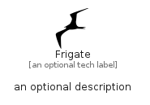

# Frigate


```text
simpleicons/F/Frigate
```

```text
include('simpleicons/F/Frigate')
```


| Illustration | Frigate |
| :---: | :---: |
|  |  |


## Sprites
The item provides the following sriptes:

- `<$FrigateXs>`
- `<$FrigateSm>`
- `<$FrigateMd>`
- `<$FrigateLg>`


## Frigate

### Load remotely
```plantuml
@startuml
' configures the library
!global $LIB_BASE_LOCATION="https://raw.githubusercontent.com/tmorin/plantuml-libs/master/distribution"

' loads the library's bootstrap
!include $LIB_BASE_LOCATION/bootstrap.puml

' loads the package bootstrap
include('simpleicons/bootstrap')

' loads the Item which embeds the element Frigate
include('simpleicons/F/Frigate')

' renders the element
Frigate('Frigate', 'Frigate', 'an optional tech label', 'an optional description')
@enduml
```

### Load locally
```plantuml
@startuml
' configures the library
!global $INCLUSION_MODE="local"
!global $LIB_BASE_LOCATION="../.."

' loads the library's bootstrap
!include $LIB_BASE_LOCATION/bootstrap.puml

' loads the package bootstrap
include('simpleicons/bootstrap')

' loads the Item which embeds the element Frigate
include('simpleicons/F/Frigate')

' renders the element
Frigate('Frigate', 'Frigate', 'an optional tech label', 'an optional description')
@enduml
```

