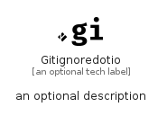

# Gitignoredotio


```text
simpleicons/G/Gitignoredotio
```

```text
include('simpleicons/G/Gitignoredotio')
```


| Illustration | Gitignoredotio |
| :---: | :---: |
|  |  |


## Sprites
The item provides the following sriptes:

- `<$GitignoredotioXs>`
- `<$GitignoredotioSm>`
- `<$GitignoredotioMd>`
- `<$GitignoredotioLg>`


## Gitignoredotio

### Load remotely
```plantuml
@startuml
' configures the library
!global $LIB_BASE_LOCATION="https://raw.githubusercontent.com/tmorin/plantuml-libs/master/distribution"

' loads the library's bootstrap
!include $LIB_BASE_LOCATION/bootstrap.puml

' loads the package bootstrap
include('simpleicons/bootstrap')

' loads the Item which embeds the element Gitignoredotio
include('simpleicons/G/Gitignoredotio')

' renders the element
Gitignoredotio('Gitignoredotio', 'Gitignoredotio', 'an optional tech label', 'an optional description')
@enduml
```

### Load locally
```plantuml
@startuml
' configures the library
!global $INCLUSION_MODE="local"
!global $LIB_BASE_LOCATION="../.."

' loads the library's bootstrap
!include $LIB_BASE_LOCATION/bootstrap.puml

' loads the package bootstrap
include('simpleicons/bootstrap')

' loads the Item which embeds the element Gitignoredotio
include('simpleicons/G/Gitignoredotio')

' renders the element
Gitignoredotio('Gitignoredotio', 'Gitignoredotio', 'an optional tech label', 'an optional description')
@enduml
```

