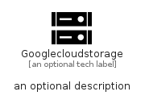

# Googlecloudstorage


```text
simpleicons/G/Googlecloudstorage
```

```text
include('simpleicons/G/Googlecloudstorage')
```


| Illustration | Googlecloudstorage |
| :---: | :---: |
|  |  |


## Sprites
The item provides the following sriptes:

- `<$GooglecloudstorageXs>`
- `<$GooglecloudstorageSm>`
- `<$GooglecloudstorageMd>`
- `<$GooglecloudstorageLg>`


## Googlecloudstorage

### Load remotely
```plantuml
@startuml
' configures the library
!global $LIB_BASE_LOCATION="https://raw.githubusercontent.com/tmorin/plantuml-libs/master/distribution"

' loads the library's bootstrap
!include $LIB_BASE_LOCATION/bootstrap.puml

' loads the package bootstrap
include('simpleicons/bootstrap')

' loads the Item which embeds the element Googlecloudstorage
include('simpleicons/G/Googlecloudstorage')

' renders the element
Googlecloudstorage('Googlecloudstorage', 'Googlecloudstorage', 'an optional tech label', 'an optional description')
@enduml
```

### Load locally
```plantuml
@startuml
' configures the library
!global $INCLUSION_MODE="local"
!global $LIB_BASE_LOCATION="../.."

' loads the library's bootstrap
!include $LIB_BASE_LOCATION/bootstrap.puml

' loads the package bootstrap
include('simpleicons/bootstrap')

' loads the Item which embeds the element Googlecloudstorage
include('simpleicons/G/Googlecloudstorage')

' renders the element
Googlecloudstorage('Googlecloudstorage', 'Googlecloudstorage', 'an optional tech label', 'an optional description')
@enduml
```

