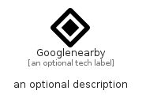

# Googlenearby


```text
simpleicons/G/Googlenearby
```

```text
include('simpleicons/G/Googlenearby')
```


| Illustration | Googlenearby |
| :---: | :---: |
|  |  |


## Sprites
The item provides the following sriptes:

- `<$GooglenearbyXs>`
- `<$GooglenearbySm>`
- `<$GooglenearbyMd>`
- `<$GooglenearbyLg>`


## Googlenearby

### Load remotely
```plantuml
@startuml
' configures the library
!global $LIB_BASE_LOCATION="https://raw.githubusercontent.com/tmorin/plantuml-libs/master/distribution"

' loads the library's bootstrap
!include $LIB_BASE_LOCATION/bootstrap.puml

' loads the package bootstrap
include('simpleicons/bootstrap')

' loads the Item which embeds the element Googlenearby
include('simpleicons/G/Googlenearby')

' renders the element
Googlenearby('Googlenearby', 'Googlenearby', 'an optional tech label', 'an optional description')
@enduml
```

### Load locally
```plantuml
@startuml
' configures the library
!global $INCLUSION_MODE="local"
!global $LIB_BASE_LOCATION="../.."

' loads the library's bootstrap
!include $LIB_BASE_LOCATION/bootstrap.puml

' loads the package bootstrap
include('simpleicons/bootstrap')

' loads the Item which embeds the element Googlenearby
include('simpleicons/G/Googlenearby')

' renders the element
Googlenearby('Googlenearby', 'Googlenearby', 'an optional tech label', 'an optional description')
@enduml
```

