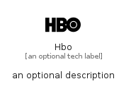

# Hbo


```text
simpleicons/H/Hbo
```

```text
include('simpleicons/H/Hbo')
```


| Illustration | Hbo |
| :---: | :---: |
|  |  |


## Sprites
The item provides the following sriptes:

- `<$HboXs>`
- `<$HboSm>`
- `<$HboMd>`
- `<$HboLg>`


## Hbo

### Load remotely
```plantuml
@startuml
' configures the library
!global $LIB_BASE_LOCATION="https://raw.githubusercontent.com/tmorin/plantuml-libs/master/distribution"

' loads the library's bootstrap
!include $LIB_BASE_LOCATION/bootstrap.puml

' loads the package bootstrap
include('simpleicons/bootstrap')

' loads the Item which embeds the element Hbo
include('simpleicons/H/Hbo')

' renders the element
Hbo('Hbo', 'Hbo', 'an optional tech label', 'an optional description')
@enduml
```

### Load locally
```plantuml
@startuml
' configures the library
!global $INCLUSION_MODE="local"
!global $LIB_BASE_LOCATION="../.."

' loads the library's bootstrap
!include $LIB_BASE_LOCATION/bootstrap.puml

' loads the package bootstrap
include('simpleicons/bootstrap')

' loads the Item which embeds the element Hbo
include('simpleicons/H/Hbo')

' renders the element
Hbo('Hbo', 'Hbo', 'an optional tech label', 'an optional description')
@enduml
```

