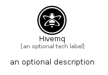

# Hivemq


```text
simpleicons/H/Hivemq
```

```text
include('simpleicons/H/Hivemq')
```


| Illustration | Hivemq |
| :---: | :---: |
|  |  |


## Sprites
The item provides the following sriptes:

- `<$HivemqXs>`
- `<$HivemqSm>`
- `<$HivemqMd>`
- `<$HivemqLg>`


## Hivemq

### Load remotely
```plantuml
@startuml
' configures the library
!global $LIB_BASE_LOCATION="https://raw.githubusercontent.com/tmorin/plantuml-libs/master/distribution"

' loads the library's bootstrap
!include $LIB_BASE_LOCATION/bootstrap.puml

' loads the package bootstrap
include('simpleicons/bootstrap')

' loads the Item which embeds the element Hivemq
include('simpleicons/H/Hivemq')

' renders the element
Hivemq('Hivemq', 'Hivemq', 'an optional tech label', 'an optional description')
@enduml
```

### Load locally
```plantuml
@startuml
' configures the library
!global $INCLUSION_MODE="local"
!global $LIB_BASE_LOCATION="../.."

' loads the library's bootstrap
!include $LIB_BASE_LOCATION/bootstrap.puml

' loads the package bootstrap
include('simpleicons/bootstrap')

' loads the Item which embeds the element Hivemq
include('simpleicons/H/Hivemq')

' renders the element
Hivemq('Hivemq', 'Hivemq', 'an optional tech label', 'an optional description')
@enduml
```

