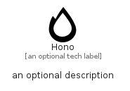

# Hono


```text
simpleicons/H/Hono
```

```text
include('simpleicons/H/Hono')
```


| Illustration | Hono |
| :---: | :---: |
|  |  |


## Sprites
The item provides the following sriptes:

- `<$HonoXs>`
- `<$HonoSm>`
- `<$HonoMd>`
- `<$HonoLg>`


## Hono

### Load remotely
```plantuml
@startuml
' configures the library
!global $LIB_BASE_LOCATION="https://raw.githubusercontent.com/tmorin/plantuml-libs/master/distribution"

' loads the library's bootstrap
!include $LIB_BASE_LOCATION/bootstrap.puml

' loads the package bootstrap
include('simpleicons/bootstrap')

' loads the Item which embeds the element Hono
include('simpleicons/H/Hono')

' renders the element
Hono('Hono', 'Hono', 'an optional tech label', 'an optional description')
@enduml
```

### Load locally
```plantuml
@startuml
' configures the library
!global $INCLUSION_MODE="local"
!global $LIB_BASE_LOCATION="../.."

' loads the library's bootstrap
!include $LIB_BASE_LOCATION/bootstrap.puml

' loads the package bootstrap
include('simpleicons/bootstrap')

' loads the Item which embeds the element Hono
include('simpleicons/H/Hono')

' renders the element
Hono('Hono', 'Hono', 'an optional tech label', 'an optional description')
@enduml
```

