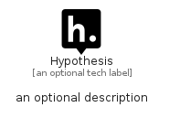

# Hypothesis


```text
simpleicons/H/Hypothesis
```

```text
include('simpleicons/H/Hypothesis')
```


| Illustration | Hypothesis |
| :---: | :---: |
|  |  |


## Sprites
The item provides the following sriptes:

- `<$HypothesisXs>`
- `<$HypothesisSm>`
- `<$HypothesisMd>`
- `<$HypothesisLg>`


## Hypothesis

### Load remotely
```plantuml
@startuml
' configures the library
!global $LIB_BASE_LOCATION="https://raw.githubusercontent.com/tmorin/plantuml-libs/master/distribution"

' loads the library's bootstrap
!include $LIB_BASE_LOCATION/bootstrap.puml

' loads the package bootstrap
include('simpleicons/bootstrap')

' loads the Item which embeds the element Hypothesis
include('simpleicons/H/Hypothesis')

' renders the element
Hypothesis('Hypothesis', 'Hypothesis', 'an optional tech label', 'an optional description')
@enduml
```

### Load locally
```plantuml
@startuml
' configures the library
!global $INCLUSION_MODE="local"
!global $LIB_BASE_LOCATION="../.."

' loads the library's bootstrap
!include $LIB_BASE_LOCATION/bootstrap.puml

' loads the package bootstrap
include('simpleicons/bootstrap')

' loads the Item which embeds the element Hypothesis
include('simpleicons/H/Hypothesis')

' renders the element
Hypothesis('Hypothesis', 'Hypothesis', 'an optional tech label', 'an optional description')
@enduml
```

