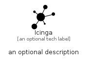

# Icinga


```text
simpleicons/I/Icinga
```

```text
include('simpleicons/I/Icinga')
```


| Illustration | Icinga |
| :---: | :---: |
|  |  |


## Sprites
The item provides the following sriptes:

- `<$IcingaXs>`
- `<$IcingaSm>`
- `<$IcingaMd>`
- `<$IcingaLg>`


## Icinga

### Load remotely
```plantuml
@startuml
' configures the library
!global $LIB_BASE_LOCATION="https://raw.githubusercontent.com/tmorin/plantuml-libs/master/distribution"

' loads the library's bootstrap
!include $LIB_BASE_LOCATION/bootstrap.puml

' loads the package bootstrap
include('simpleicons/bootstrap')

' loads the Item which embeds the element Icinga
include('simpleicons/I/Icinga')

' renders the element
Icinga('Icinga', 'Icinga', 'an optional tech label', 'an optional description')
@enduml
```

### Load locally
```plantuml
@startuml
' configures the library
!global $INCLUSION_MODE="local"
!global $LIB_BASE_LOCATION="../.."

' loads the library's bootstrap
!include $LIB_BASE_LOCATION/bootstrap.puml

' loads the package bootstrap
include('simpleicons/bootstrap')

' loads the Item which embeds the element Icinga
include('simpleicons/I/Icinga')

' renders the element
Icinga('Icinga', 'Icinga', 'an optional tech label', 'an optional description')
@enduml
```

