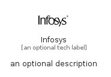

# Infosys


```text
simpleicons/I/Infosys
```

```text
include('simpleicons/I/Infosys')
```


| Illustration | Infosys |
| :---: | :---: |
|  |  |


## Sprites
The item provides the following sriptes:

- `<$InfosysXs>`
- `<$InfosysSm>`
- `<$InfosysMd>`
- `<$InfosysLg>`


## Infosys

### Load remotely
```plantuml
@startuml
' configures the library
!global $LIB_BASE_LOCATION="https://raw.githubusercontent.com/tmorin/plantuml-libs/master/distribution"

' loads the library's bootstrap
!include $LIB_BASE_LOCATION/bootstrap.puml

' loads the package bootstrap
include('simpleicons/bootstrap')

' loads the Item which embeds the element Infosys
include('simpleicons/I/Infosys')

' renders the element
Infosys('Infosys', 'Infosys', 'an optional tech label', 'an optional description')
@enduml
```

### Load locally
```plantuml
@startuml
' configures the library
!global $INCLUSION_MODE="local"
!global $LIB_BASE_LOCATION="../.."

' loads the library's bootstrap
!include $LIB_BASE_LOCATION/bootstrap.puml

' loads the package bootstrap
include('simpleicons/bootstrap')

' loads the Item which embeds the element Infosys
include('simpleicons/I/Infosys')

' renders the element
Infosys('Infosys', 'Infosys', 'an optional tech label', 'an optional description')
@enduml
```

