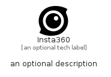

# Insta360


```text
simpleicons/I/Insta360
```

```text
include('simpleicons/I/Insta360')
```


| Illustration | Insta360 |
| :---: | :---: |
|  |  |


## Sprites
The item provides the following sriptes:

- `<$Insta360Xs>`
- `<$Insta360Sm>`
- `<$Insta360Md>`
- `<$Insta360Lg>`


## Insta360

### Load remotely
```plantuml
@startuml
' configures the library
!global $LIB_BASE_LOCATION="https://raw.githubusercontent.com/tmorin/plantuml-libs/master/distribution"

' loads the library's bootstrap
!include $LIB_BASE_LOCATION/bootstrap.puml

' loads the package bootstrap
include('simpleicons/bootstrap')

' loads the Item which embeds the element Insta360
include('simpleicons/I/Insta360')

' renders the element
Insta360('Insta360', 'Insta360', 'an optional tech label', 'an optional description')
@enduml
```

### Load locally
```plantuml
@startuml
' configures the library
!global $INCLUSION_MODE="local"
!global $LIB_BASE_LOCATION="../.."

' loads the library's bootstrap
!include $LIB_BASE_LOCATION/bootstrap.puml

' loads the package bootstrap
include('simpleicons/bootstrap')

' loads the Item which embeds the element Insta360
include('simpleicons/I/Insta360')

' renders the element
Insta360('Insta360', 'Insta360', 'an optional tech label', 'an optional description')
@enduml
```

