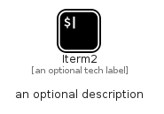

# Iterm2


```text
simpleicons/I/Iterm2
```

```text
include('simpleicons/I/Iterm2')
```


| Illustration | Iterm2 |
| :---: | :---: |
|  |  |


## Sprites
The item provides the following sriptes:

- `<$Iterm2Xs>`
- `<$Iterm2Sm>`
- `<$Iterm2Md>`
- `<$Iterm2Lg>`


## Iterm2

### Load remotely
```plantuml
@startuml
' configures the library
!global $LIB_BASE_LOCATION="https://raw.githubusercontent.com/tmorin/plantuml-libs/master/distribution"

' loads the library's bootstrap
!include $LIB_BASE_LOCATION/bootstrap.puml

' loads the package bootstrap
include('simpleicons/bootstrap')

' loads the Item which embeds the element Iterm2
include('simpleicons/I/Iterm2')

' renders the element
Iterm2('Iterm2', 'Iterm2', 'an optional tech label', 'an optional description')
@enduml
```

### Load locally
```plantuml
@startuml
' configures the library
!global $INCLUSION_MODE="local"
!global $LIB_BASE_LOCATION="../.."

' loads the library's bootstrap
!include $LIB_BASE_LOCATION/bootstrap.puml

' loads the package bootstrap
include('simpleicons/bootstrap')

' loads the Item which embeds the element Iterm2
include('simpleicons/I/Iterm2')

' renders the element
Iterm2('Iterm2', 'Iterm2', 'an optional tech label', 'an optional description')
@enduml
```

