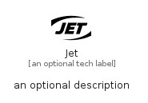

# Jet


```text
simpleicons/J/Jet
```

```text
include('simpleicons/J/Jet')
```


| Illustration | Jet |
| :---: | :---: |
|  |  |


## Sprites
The item provides the following sriptes:

- `<$JetXs>`
- `<$JetSm>`
- `<$JetMd>`
- `<$JetLg>`


## Jet

### Load remotely
```plantuml
@startuml
' configures the library
!global $LIB_BASE_LOCATION="https://raw.githubusercontent.com/tmorin/plantuml-libs/master/distribution"

' loads the library's bootstrap
!include $LIB_BASE_LOCATION/bootstrap.puml

' loads the package bootstrap
include('simpleicons/bootstrap')

' loads the Item which embeds the element Jet
include('simpleicons/J/Jet')

' renders the element
Jet('Jet', 'Jet', 'an optional tech label', 'an optional description')
@enduml
```

### Load locally
```plantuml
@startuml
' configures the library
!global $INCLUSION_MODE="local"
!global $LIB_BASE_LOCATION="../.."

' loads the library's bootstrap
!include $LIB_BASE_LOCATION/bootstrap.puml

' loads the package bootstrap
include('simpleicons/bootstrap')

' loads the Item which embeds the element Jet
include('simpleicons/J/Jet')

' renders the element
Jet('Jet', 'Jet', 'an optional tech label', 'an optional description')
@enduml
```

