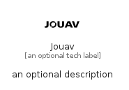

# Jouav


```text
simpleicons/J/Jouav
```

```text
include('simpleicons/J/Jouav')
```


| Illustration | Jouav |
| :---: | :---: |
|  |  |


## Sprites
The item provides the following sriptes:

- `<$JouavXs>`
- `<$JouavSm>`
- `<$JouavMd>`
- `<$JouavLg>`


## Jouav

### Load remotely
```plantuml
@startuml
' configures the library
!global $LIB_BASE_LOCATION="https://raw.githubusercontent.com/tmorin/plantuml-libs/master/distribution"

' loads the library's bootstrap
!include $LIB_BASE_LOCATION/bootstrap.puml

' loads the package bootstrap
include('simpleicons/bootstrap')

' loads the Item which embeds the element Jouav
include('simpleicons/J/Jouav')

' renders the element
Jouav('Jouav', 'Jouav', 'an optional tech label', 'an optional description')
@enduml
```

### Load locally
```plantuml
@startuml
' configures the library
!global $INCLUSION_MODE="local"
!global $LIB_BASE_LOCATION="../.."

' loads the library's bootstrap
!include $LIB_BASE_LOCATION/bootstrap.puml

' loads the package bootstrap
include('simpleicons/bootstrap')

' loads the Item which embeds the element Jouav
include('simpleicons/J/Jouav')

' renders the element
Jouav('Jouav', 'Jouav', 'an optional tech label', 'an optional description')
@enduml
```

