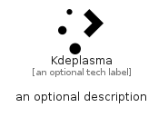

# Kdeplasma


```text
simpleicons/K/Kdeplasma
```

```text
include('simpleicons/K/Kdeplasma')
```


| Illustration | Kdeplasma |
| :---: | :---: |
|  |  |


## Sprites
The item provides the following sriptes:

- `<$KdeplasmaXs>`
- `<$KdeplasmaSm>`
- `<$KdeplasmaMd>`
- `<$KdeplasmaLg>`


## Kdeplasma

### Load remotely
```plantuml
@startuml
' configures the library
!global $LIB_BASE_LOCATION="https://raw.githubusercontent.com/tmorin/plantuml-libs/master/distribution"

' loads the library's bootstrap
!include $LIB_BASE_LOCATION/bootstrap.puml

' loads the package bootstrap
include('simpleicons/bootstrap')

' loads the Item which embeds the element Kdeplasma
include('simpleicons/K/Kdeplasma')

' renders the element
Kdeplasma('Kdeplasma', 'Kdeplasma', 'an optional tech label', 'an optional description')
@enduml
```

### Load locally
```plantuml
@startuml
' configures the library
!global $INCLUSION_MODE="local"
!global $LIB_BASE_LOCATION="../.."

' loads the library's bootstrap
!include $LIB_BASE_LOCATION/bootstrap.puml

' loads the package bootstrap
include('simpleicons/bootstrap')

' loads the Item which embeds the element Kdeplasma
include('simpleicons/K/Kdeplasma')

' renders the element
Kdeplasma('Kdeplasma', 'Kdeplasma', 'an optional tech label', 'an optional description')
@enduml
```

