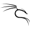
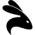
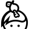
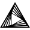
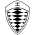
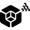

# K

The module contains 93 items.

| |Name|
|:---:|---|
|  | [simpleicons/K/K3S](../../simpleicons/K/K3S.md) |
|  | [simpleicons/K/K6](../../simpleicons/K/K6.md) |
|  | [simpleicons/K/Kaggle](../../simpleicons/K/Kaggle.md) |
|  | [simpleicons/K/Kagi](../../simpleicons/K/Kagi.md) |
|  | [simpleicons/K/Kahoot](../../simpleicons/K/Kahoot.md) |
|  | [simpleicons/K/Kaios](../../simpleicons/K/Kaios.md) |
|  | [simpleicons/K/Kakao](../../simpleicons/K/Kakao.md) |
|  | [simpleicons/K/Kakaotalk](../../simpleicons/K/Kakaotalk.md) |
|  | [simpleicons/K/Kalilinux](../../simpleicons/K/Kalilinux.md) |
|  | [simpleicons/K/Kamailio](../../simpleicons/K/Kamailio.md) |
|  | [simpleicons/K/Kando](../../simpleicons/K/Kando.md) |
|  | [simpleicons/K/Kaniko](../../simpleicons/K/Kaniko.md) |
|  | [simpleicons/K/Karlsruherverkehrsverbund](../../simpleicons/K/Karlsruherverkehrsverbund.md) |
|  | [simpleicons/K/Kasasmart](../../simpleicons/K/Kasasmart.md) |
|  | [simpleicons/K/Kashflow](../../simpleicons/K/Kashflow.md) |
|  | [simpleicons/K/Kaspersky](../../simpleicons/K/Kaspersky.md) |
|  | [simpleicons/K/Katana](../../simpleicons/K/Katana.md) |
|  | [simpleicons/K/Kaufland](../../simpleicons/K/Kaufland.md) |
|  | [simpleicons/K/Kde](../../simpleicons/K/Kde.md) |
|  | [simpleicons/K/Kdeneon](../../simpleicons/K/Kdeneon.md) |
|  | [simpleicons/K/Kdenlive](../../simpleicons/K/Kdenlive.md) |
|  | [simpleicons/K/Kdeplasma](../../simpleicons/K/Kdeplasma.md) |
|  | [simpleicons/K/Kedro](../../simpleicons/K/Kedro.md) |
|  | [simpleicons/K/Keenetic](../../simpleicons/K/Keenetic.md) |
|  | [simpleicons/K/Keepachangelog](../../simpleicons/K/Keepachangelog.md) |
|  | [simpleicons/K/Keepassxc](../../simpleicons/K/Keepassxc.md) |
|  | [simpleicons/K/Keeper](../../simpleicons/K/Keeper.md) |
|  | [simpleicons/K/Keeweb](../../simpleicons/K/Keeweb.md) |
|  | [simpleicons/K/Kenmei](../../simpleicons/K/Kenmei.md) |
|  | [simpleicons/K/Kentico](../../simpleicons/K/Kentico.md) |
|  | [simpleicons/K/Keploy](../../simpleicons/K/Keploy.md) |
|  | [simpleicons/K/Keras](../../simpleicons/K/Keras.md) |
|  | [simpleicons/K/Keybase](../../simpleicons/K/Keybase.md) |
|  | [simpleicons/K/Keycdn](../../simpleicons/K/Keycdn.md) |
|  | [simpleicons/K/Keycloak](../../simpleicons/K/Keycloak.md) |
|  | [simpleicons/K/Keystone](../../simpleicons/K/Keystone.md) |
|  | [simpleicons/K/Kfc](../../simpleicons/K/Kfc.md) |
|  | [simpleicons/K/Khanacademy](../../simpleicons/K/Khanacademy.md) |
|  | [simpleicons/K/Khronosgroup](../../simpleicons/K/Khronosgroup.md) |
|  | [simpleicons/K/Kia](../../simpleicons/K/Kia.md) |
|  | [simpleicons/K/Kibana](../../simpleicons/K/Kibana.md) |
|  | [simpleicons/K/Kicad](../../simpleicons/K/Kicad.md) |
|  | [simpleicons/K/Kick](../../simpleicons/K/Kick.md) |
|  | [simpleicons/K/Kickstarter](../../simpleicons/K/Kickstarter.md) |
|  | [simpleicons/K/Kik](../../simpleicons/K/Kik.md) |
|  | [simpleicons/K/Kingstontechnology](../../simpleicons/K/Kingstontechnology.md) |
|  | [simpleicons/K/Kinopoisk](../../simpleicons/K/Kinopoisk.md) |
|  | [simpleicons/K/Kinsta](../../simpleicons/K/Kinsta.md) |
|  | [simpleicons/K/Kirby](../../simpleicons/K/Kirby.md) |
|  | [simpleicons/K/Kit](../../simpleicons/K/Kit.md) |
|  | [simpleicons/K/Kitsu](../../simpleicons/K/Kitsu.md) |
|  | [simpleicons/K/Kiwix](../../simpleicons/K/Kiwix.md) |
|  | [simpleicons/K/Klarna](../../simpleicons/K/Klarna.md) |
|  | [simpleicons/K/Kleinanzeigen](../../simpleicons/K/Kleinanzeigen.md) |
|  | [simpleicons/K/Klm](../../simpleicons/K/Klm.md) |
|  | [simpleicons/K/Klook](../../simpleicons/K/Klook.md) |
|  | [simpleicons/K/Knative](../../simpleicons/K/Knative.md) |
|  | [simpleicons/K/Knexdotjs](../../simpleicons/K/Knexdotjs.md) |
|  | [simpleicons/K/Knime](../../simpleicons/K/Knime.md) |
|  | [simpleicons/K/Knip](../../simpleicons/K/Knip.md) |
|  | [simpleicons/K/Knowledgebase](../../simpleicons/K/Knowledgebase.md) |
|  | [simpleicons/K/Known](../../simpleicons/K/Known.md) |
|  | [simpleicons/K/Koa](../../simpleicons/K/Koa.md) |
|  | [simpleicons/K/Koc](../../simpleicons/K/Koc.md) |
|  | [simpleicons/K/Kodak](../../simpleicons/K/Kodak.md) |
|  | [simpleicons/K/Kodi](../../simpleicons/K/Kodi.md) |
|  | [simpleicons/K/Kodular](../../simpleicons/K/Kodular.md) |
|  | [simpleicons/K/Koenigsegg](../../simpleicons/K/Koenigsegg.md) |
|  | [simpleicons/K/Kofax](../../simpleicons/K/Kofax.md) |
|  | [simpleicons/K/Kofi](../../simpleicons/K/Kofi.md) |
|  | [simpleicons/K/Komoot](../../simpleicons/K/Komoot.md) |
|  | [simpleicons/K/Konami](../../simpleicons/K/Konami.md) |
|  | [simpleicons/K/Kong](../../simpleicons/K/Kong.md) |
|  | [simpleicons/K/Kongregate](../../simpleicons/K/Kongregate.md) |
|  | [simpleicons/K/Konva](../../simpleicons/K/Konva.md) |
|  | [simpleicons/K/Koreader](../../simpleicons/K/Koreader.md) |
|  | [simpleicons/K/Kotlin](../../simpleicons/K/Kotlin.md) |
|  | [simpleicons/K/Koyeb](../../simpleicons/K/Koyeb.md) |
|  | [simpleicons/K/Kred](../../simpleicons/K/Kred.md) |
|  | [simpleicons/K/Krita](../../simpleicons/K/Krita.md) |
|  | [simpleicons/K/Ktm](../../simpleicons/K/Ktm.md) |
|  | [simpleicons/K/Ktor](../../simpleicons/K/Ktor.md) |
|  | [simpleicons/K/Kuaishou](../../simpleicons/K/Kuaishou.md) |
|  | [simpleicons/K/Kubernetes](../../simpleicons/K/Kubernetes.md) |
|  | [simpleicons/K/Kubespray](../../simpleicons/K/Kubespray.md) |
|  | [simpleicons/K/Kubuntu](../../simpleicons/K/Kubuntu.md) |
|  | [simpleicons/K/Kucoin](../../simpleicons/K/Kucoin.md) |
|  | [simpleicons/K/Kueski](../../simpleicons/K/Kueski.md) |
|  | [simpleicons/K/Kuma](../../simpleicons/K/Kuma.md) |
|  | [simpleicons/K/Kununu](../../simpleicons/K/Kununu.md) |
|  | [simpleicons/K/Kuula](../../simpleicons/K/Kuula.md) |
|  | [simpleicons/K/Kx](../../simpleicons/K/Kx.md) |
|  | [simpleicons/K/Kyocera](../../simpleicons/K/Kyocera.md) |

