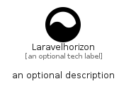

# Laravelhorizon


```text
simpleicons/L/Laravelhorizon
```

```text
include('simpleicons/L/Laravelhorizon')
```


| Illustration | Laravelhorizon |
| :---: | :---: |
|  |  |


## Sprites
The item provides the following sriptes:

- `<$LaravelhorizonXs>`
- `<$LaravelhorizonSm>`
- `<$LaravelhorizonMd>`
- `<$LaravelhorizonLg>`


## Laravelhorizon

### Load remotely
```plantuml
@startuml
' configures the library
!global $LIB_BASE_LOCATION="https://raw.githubusercontent.com/tmorin/plantuml-libs/master/distribution"

' loads the library's bootstrap
!include $LIB_BASE_LOCATION/bootstrap.puml

' loads the package bootstrap
include('simpleicons/bootstrap')

' loads the Item which embeds the element Laravelhorizon
include('simpleicons/L/Laravelhorizon')

' renders the element
Laravelhorizon('Laravelhorizon', 'Laravelhorizon', 'an optional tech label', 'an optional description')
@enduml
```

### Load locally
```plantuml
@startuml
' configures the library
!global $INCLUSION_MODE="local"
!global $LIB_BASE_LOCATION="../.."

' loads the library's bootstrap
!include $LIB_BASE_LOCATION/bootstrap.puml

' loads the package bootstrap
include('simpleicons/bootstrap')

' loads the Item which embeds the element Laravelhorizon
include('simpleicons/L/Laravelhorizon')

' renders the element
Laravelhorizon('Laravelhorizon', 'Laravelhorizon', 'an optional tech label', 'an optional description')
@enduml
```

