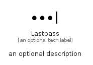

# Lastpass


```text
simpleicons/L/Lastpass
```

```text
include('simpleicons/L/Lastpass')
```


| Illustration | Lastpass |
| :---: | :---: |
|  |  |


## Sprites
The item provides the following sriptes:

- `<$LastpassXs>`
- `<$LastpassSm>`
- `<$LastpassMd>`
- `<$LastpassLg>`


## Lastpass

### Load remotely
```plantuml
@startuml
' configures the library
!global $LIB_BASE_LOCATION="https://raw.githubusercontent.com/tmorin/plantuml-libs/master/distribution"

' loads the library's bootstrap
!include $LIB_BASE_LOCATION/bootstrap.puml

' loads the package bootstrap
include('simpleicons/bootstrap')

' loads the Item which embeds the element Lastpass
include('simpleicons/L/Lastpass')

' renders the element
Lastpass('Lastpass', 'Lastpass', 'an optional tech label', 'an optional description')
@enduml
```

### Load locally
```plantuml
@startuml
' configures the library
!global $INCLUSION_MODE="local"
!global $LIB_BASE_LOCATION="../.."

' loads the library's bootstrap
!include $LIB_BASE_LOCATION/bootstrap.puml

' loads the package bootstrap
include('simpleicons/bootstrap')

' loads the Item which embeds the element Lastpass
include('simpleicons/L/Lastpass')

' renders the element
Lastpass('Lastpass', 'Lastpass', 'an optional tech label', 'an optional description')
@enduml
```

