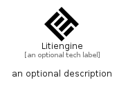

# Litiengine


```text
simpleicons/L/Litiengine
```

```text
include('simpleicons/L/Litiengine')
```


| Illustration | Litiengine |
| :---: | :---: |
|  |  |


## Sprites
The item provides the following sriptes:

- `<$LitiengineXs>`
- `<$LitiengineSm>`
- `<$LitiengineMd>`
- `<$LitiengineLg>`


## Litiengine

### Load remotely
```plantuml
@startuml
' configures the library
!global $LIB_BASE_LOCATION="https://raw.githubusercontent.com/tmorin/plantuml-libs/master/distribution"

' loads the library's bootstrap
!include $LIB_BASE_LOCATION/bootstrap.puml

' loads the package bootstrap
include('simpleicons/bootstrap')

' loads the Item which embeds the element Litiengine
include('simpleicons/L/Litiengine')

' renders the element
Litiengine('Litiengine', 'Litiengine', 'an optional tech label', 'an optional description')
@enduml
```

### Load locally
```plantuml
@startuml
' configures the library
!global $INCLUSION_MODE="local"
!global $LIB_BASE_LOCATION="../.."

' loads the library's bootstrap
!include $LIB_BASE_LOCATION/bootstrap.puml

' loads the package bootstrap
include('simpleicons/bootstrap')

' loads the Item which embeds the element Litiengine
include('simpleicons/L/Litiengine')

' renders the element
Litiengine('Litiengine', 'Litiengine', 'an optional tech label', 'an optional description')
@enduml
```

