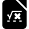
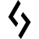
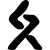

# L

The module contains 127 items.

| |Name|
|:---:|---|
|  | [simpleicons/L/Labex](../../simpleicons/L/Labex.md) |
|  | [simpleicons/L/Labview](../../simpleicons/L/Labview.md) |
|  | [simpleicons/L/Lada](../../simpleicons/L/Lada.md) |
|  | [simpleicons/L/Lamborghini](../../simpleicons/L/Lamborghini.md) |
|  | [simpleicons/L/Langchain](../../simpleicons/L/Langchain.md) |
|  | [simpleicons/L/Langflow](../../simpleicons/L/Langflow.md) |
|  | [simpleicons/L/Langgraph](../../simpleicons/L/Langgraph.md) |
|  | [simpleicons/L/Languagetool](../../simpleicons/L/Languagetool.md) |
|  | [simpleicons/L/Lapce](../../simpleicons/L/Lapce.md) |
|  | [simpleicons/L/Laragon](../../simpleicons/L/Laragon.md) |
|  | [simpleicons/L/Laravel](../../simpleicons/L/Laravel.md) |
|  | [simpleicons/L/Laravelhorizon](../../simpleicons/L/Laravelhorizon.md) |
|  | [simpleicons/L/Laravelnova](../../simpleicons/L/Laravelnova.md) |
|  | [simpleicons/L/Lastdotfm](../../simpleicons/L/Lastdotfm.md) |
|  | [simpleicons/L/Lastpass](../../simpleicons/L/Lastpass.md) |
|  | [simpleicons/L/Latex](../../simpleicons/L/Latex.md) |
|  | [simpleicons/L/Launchpad](../../simpleicons/L/Launchpad.md) |
|  | [simpleicons/L/Lazarus](../../simpleicons/L/Lazarus.md) |
|  | [simpleicons/L/Lazyvim](../../simpleicons/L/Lazyvim.md) |
|  | [simpleicons/L/Lbry](../../simpleicons/L/Lbry.md) |
|  | [simpleicons/L/Leaderprice](../../simpleicons/L/Leaderprice.md) |
|  | [simpleicons/L/Leaflet](../../simpleicons/L/Leaflet.md) |
|  | [simpleicons/L/Leagueoflegends](../../simpleicons/L/Leagueoflegends.md) |
|  | [simpleicons/L/Leanpub](../../simpleicons/L/Leanpub.md) |
|  | [simpleicons/L/Leetcode](../../simpleicons/L/Leetcode.md) |
|  | [simpleicons/L/Lefthook](../../simpleicons/L/Lefthook.md) |
|  | [simpleicons/L/Legacygames](../../simpleicons/L/Legacygames.md) |
|  | [simpleicons/L/Leica](../../simpleicons/L/Leica.md) |
|  | [simpleicons/L/Lemmy](../../simpleicons/L/Lemmy.md) |
|  | [simpleicons/L/Lemonsqueezy](../../simpleicons/L/Lemonsqueezy.md) |
|  | [simpleicons/L/Lenovo](../../simpleicons/L/Lenovo.md) |
|  | [simpleicons/L/Lens](../../simpleicons/L/Lens.md) |
|  | [simpleicons/L/Leptos](../../simpleicons/L/Leptos.md) |
|  | [simpleicons/L/Lequipe](../../simpleicons/L/Lequipe.md) |
|  | [simpleicons/L/Lerna](../../simpleicons/L/Lerna.md) |
|  | [simpleicons/L/Leroymerlin](../../simpleicons/L/Leroymerlin.md) |
|  | [simpleicons/L/Leslibraires](../../simpleicons/L/Leslibraires.md) |
|  | [simpleicons/L/Less](../../simpleicons/L/Less.md) |
|  | [simpleicons/L/Letsencrypt](../../simpleicons/L/Letsencrypt.md) |
|  | [simpleicons/L/Letterboxd](../../simpleicons/L/Letterboxd.md) |
|  | [simpleicons/L/Levelsdotfyi](../../simpleicons/L/Levelsdotfyi.md) |
|  | [simpleicons/L/Lg](../../simpleicons/L/Lg.md) |
|  | [simpleicons/L/Liberadotchat](../../simpleicons/L/Liberadotchat.md) |
|  | [simpleicons/L/Liberapay](../../simpleicons/L/Liberapay.md) |
|  | [simpleicons/L/Librariesdotio](../../simpleicons/L/Librariesdotio.md) |
|  | [simpleicons/L/Librarything](../../simpleicons/L/Librarything.md) |
|  | [simpleicons/L/Libreoffice](../../simpleicons/L/Libreoffice.md) |
|  | [simpleicons/L/Libreofficebase](../../simpleicons/L/Libreofficebase.md) |
|  | [simpleicons/L/Libreofficecalc](../../simpleicons/L/Libreofficecalc.md) |
|  | [simpleicons/L/Libreofficedraw](../../simpleicons/L/Libreofficedraw.md) |
|  | [simpleicons/L/Libreofficeimpress](../../simpleicons/L/Libreofficeimpress.md) |
|  | [simpleicons/L/Libreofficemath](../../simpleicons/L/Libreofficemath.md) |
|  | [simpleicons/L/Libreofficewriter](../../simpleicons/L/Libreofficewriter.md) |
|  | [simpleicons/L/Libretranslate](../../simpleicons/L/Libretranslate.md) |
|  | [simpleicons/L/Libretube](../../simpleicons/L/Libretube.md) |
|  | [simpleicons/L/Librewolf](../../simpleicons/L/Librewolf.md) |
|  | [simpleicons/L/Libuv](../../simpleicons/L/Libuv.md) |
|  | [simpleicons/L/Lichess](../../simpleicons/L/Lichess.md) |
|  | [simpleicons/L/Lidl](../../simpleicons/L/Lidl.md) |
|  | [simpleicons/L/Lifx](../../simpleicons/L/Lifx.md) |
|  | [simpleicons/L/Lightburn](../../simpleicons/L/Lightburn.md) |
|  | [simpleicons/L/Lighthouse](../../simpleicons/L/Lighthouse.md) |
|  | [simpleicons/L/Lightning](../../simpleicons/L/Lightning.md) |
|  | [simpleicons/L/Limesurvey](../../simpleicons/L/Limesurvey.md) |
|  | [simpleicons/L/Line](../../simpleicons/L/Line.md) |
|  | [simpleicons/L/Lineageos](../../simpleicons/L/Lineageos.md) |
|  | [simpleicons/L/Linear](../../simpleicons/L/Linear.md) |
|  | [simpleicons/L/Lining](../../simpleicons/L/Lining.md) |
|  | [simpleicons/L/Linkerd](../../simpleicons/L/Linkerd.md) |
|  | [simpleicons/L/Linkfire](../../simpleicons/L/Linkfire.md) |
|  | [simpleicons/L/Linksys](../../simpleicons/L/Linksys.md) |
|  | [simpleicons/L/Linktree](../../simpleicons/L/Linktree.md) |
|  | [simpleicons/L/Linphone](../../simpleicons/L/Linphone.md) |
|  | [simpleicons/L/Lintcode](../../simpleicons/L/Lintcode.md) |
|  | [simpleicons/L/Linux](../../simpleicons/L/Linux.md) |
|  | [simpleicons/L/Linuxcontainers](../../simpleicons/L/Linuxcontainers.md) |
|  | [simpleicons/L/Linuxfoundation](../../simpleicons/L/Linuxfoundation.md) |
|  | [simpleicons/L/Linuxmint](../../simpleicons/L/Linuxmint.md) |
|  | [simpleicons/L/Linuxprofessionalinstitute](../../simpleicons/L/Linuxprofessionalinstitute.md) |
|  | [simpleicons/L/Linuxserver](../../simpleicons/L/Linuxserver.md) |
|  | [simpleicons/L/Lionair](../../simpleicons/L/Lionair.md) |
|  | [simpleicons/L/Liquibase](../../simpleicons/L/Liquibase.md) |
|  | [simpleicons/L/Listenhub](../../simpleicons/L/Listenhub.md) |
|  | [simpleicons/L/Listmonk](../../simpleicons/L/Listmonk.md) |
|  | [simpleicons/L/Lit](../../simpleicons/L/Lit.md) |
|  | [simpleicons/L/Litecoin](../../simpleicons/L/Litecoin.md) |
|  | [simpleicons/L/Literal](../../simpleicons/L/Literal.md) |
|  | [simpleicons/L/Litiengine](../../simpleicons/L/Litiengine.md) |
|  | [simpleicons/L/Livechat](../../simpleicons/L/Livechat.md) |
|  | [simpleicons/L/Livejournal](../../simpleicons/L/Livejournal.md) |
|  | [simpleicons/L/Livekit](../../simpleicons/L/Livekit.md) |
|  | [simpleicons/L/Livewire](../../simpleicons/L/Livewire.md) |
|  | [simpleicons/L/Llvm](../../simpleicons/L/Llvm.md) |
|  | [simpleicons/L/Lmms](../../simpleicons/L/Lmms.md) |
|  | [simpleicons/L/Lobsters](../../simpleicons/L/Lobsters.md) |
|  | [simpleicons/L/Local](../../simpleicons/L/Local.md) |
|  | [simpleicons/L/Localsend](../../simpleicons/L/Localsend.md) |
|  | [simpleicons/L/Localxpose](../../simpleicons/L/Localxpose.md) |
|  | [simpleicons/L/Lodash](../../simpleicons/L/Lodash.md) |
|  | [simpleicons/L/Logmein](../../simpleicons/L/Logmein.md) |
|  | [simpleicons/L/Logseq](../../simpleicons/L/Logseq.md) |
|  | [simpleicons/L/Logstash](../../simpleicons/L/Logstash.md) |
|  | [simpleicons/L/Looker](../../simpleicons/L/Looker.md) |
|  | [simpleicons/L/Loom](../../simpleicons/L/Loom.md) |
|  | [simpleicons/L/Loop](../../simpleicons/L/Loop.md) |
|  | [simpleicons/L/Loopback](../../simpleicons/L/Loopback.md) |
|  | [simpleicons/L/Lootcrate](../../simpleicons/L/Lootcrate.md) |
|  | [simpleicons/L/Lospec](../../simpleicons/L/Lospec.md) |
|  | [simpleicons/L/Lotpolishairlines](../../simpleicons/L/Lotpolishairlines.md) |
|  | [simpleicons/L/Lottiefiles](../../simpleicons/L/Lottiefiles.md) |
|  | [simpleicons/L/Ltspice](../../simpleicons/L/Ltspice.md) |
|  | [simpleicons/L/Lua](../../simpleicons/L/Lua.md) |
|  | [simpleicons/L/Luanti](../../simpleicons/L/Luanti.md) |
|  | [simpleicons/L/Luau](../../simpleicons/L/Luau.md) |
|  | [simpleicons/L/Lubuntu](../../simpleicons/L/Lubuntu.md) |
|  | [simpleicons/L/Lucia](../../simpleicons/L/Lucia.md) |
|  | [simpleicons/L/Lucid](../../simpleicons/L/Lucid.md) |
|  | [simpleicons/L/Lucide](../../simpleicons/L/Lucide.md) |
|  | [simpleicons/L/Ludwig](../../simpleicons/L/Ludwig.md) |
|  | [simpleicons/L/Lufthansa](../../simpleicons/L/Lufthansa.md) |
|  | [simpleicons/L/Lumen](../../simpleicons/L/Lumen.md) |
|  | [simpleicons/L/Lunacy](../../simpleicons/L/Lunacy.md) |
|  | [simpleicons/L/Luogu](../../simpleicons/L/Luogu.md) |
|  | [simpleicons/L/Lutris](../../simpleicons/L/Lutris.md) |
|  | [simpleicons/L/Lvgl](../../simpleicons/L/Lvgl.md) |
|  | [simpleicons/L/Lydia](../../simpleicons/L/Lydia.md) |
|  | [simpleicons/L/Lyft](../../simpleicons/L/Lyft.md) |

