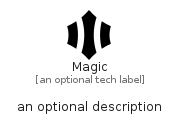

# Magic


```text
simpleicons/M/Magic
```

```text
include('simpleicons/M/Magic')
```


| Illustration | Magic |
| :---: | :---: |
|  |  |


## Sprites
The item provides the following sriptes:

- `<$MagicXs>`
- `<$MagicSm>`
- `<$MagicMd>`
- `<$MagicLg>`


## Magic

### Load remotely
```plantuml
@startuml
' configures the library
!global $LIB_BASE_LOCATION="https://raw.githubusercontent.com/tmorin/plantuml-libs/master/distribution"

' loads the library's bootstrap
!include $LIB_BASE_LOCATION/bootstrap.puml

' loads the package bootstrap
include('simpleicons/bootstrap')

' loads the Item which embeds the element Magic
include('simpleicons/M/Magic')

' renders the element
Magic('Magic', 'Magic', 'an optional tech label', 'an optional description')
@enduml
```

### Load locally
```plantuml
@startuml
' configures the library
!global $INCLUSION_MODE="local"
!global $LIB_BASE_LOCATION="../.."

' loads the library's bootstrap
!include $LIB_BASE_LOCATION/bootstrap.puml

' loads the package bootstrap
include('simpleicons/bootstrap')

' loads the Item which embeds the element Magic
include('simpleicons/M/Magic')

' renders the element
Magic('Magic', 'Magic', 'an optional tech label', 'an optional description')
@enduml
```

