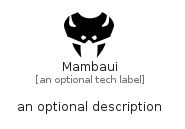

# Mambaui


```text
simpleicons/M/Mambaui
```

```text
include('simpleicons/M/Mambaui')
```


| Illustration | Mambaui |
| :---: | :---: |
|  |  |


## Sprites
The item provides the following sriptes:

- `<$MambauiXs>`
- `<$MambauiSm>`
- `<$MambauiMd>`
- `<$MambauiLg>`


## Mambaui

### Load remotely
```plantuml
@startuml
' configures the library
!global $LIB_BASE_LOCATION="https://raw.githubusercontent.com/tmorin/plantuml-libs/master/distribution"

' loads the library's bootstrap
!include $LIB_BASE_LOCATION/bootstrap.puml

' loads the package bootstrap
include('simpleicons/bootstrap')

' loads the Item which embeds the element Mambaui
include('simpleicons/M/Mambaui')

' renders the element
Mambaui('Mambaui', 'Mambaui', 'an optional tech label', 'an optional description')
@enduml
```

### Load locally
```plantuml
@startuml
' configures the library
!global $INCLUSION_MODE="local"
!global $LIB_BASE_LOCATION="../.."

' loads the library's bootstrap
!include $LIB_BASE_LOCATION/bootstrap.puml

' loads the package bootstrap
include('simpleicons/bootstrap')

' loads the Item which embeds the element Mambaui
include('simpleicons/M/Mambaui')

' renders the element
Mambaui('Mambaui', 'Mambaui', 'an optional tech label', 'an optional description')
@enduml
```

