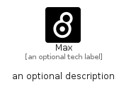

# Max


```text
simpleicons/M/Max
```

```text
include('simpleicons/M/Max')
```


| Illustration | Max |
| :---: | :---: |
|  |  |


## Sprites
The item provides the following sriptes:

- `<$MaxXs>`
- `<$MaxSm>`
- `<$MaxMd>`
- `<$MaxLg>`


## Max

### Load remotely
```plantuml
@startuml
' configures the library
!global $LIB_BASE_LOCATION="https://raw.githubusercontent.com/tmorin/plantuml-libs/master/distribution"

' loads the library's bootstrap
!include $LIB_BASE_LOCATION/bootstrap.puml

' loads the package bootstrap
include('simpleicons/bootstrap')

' loads the Item which embeds the element Max
include('simpleicons/M/Max')

' renders the element
Max('Max', 'Max', 'an optional tech label', 'an optional description')
@enduml
```

### Load locally
```plantuml
@startuml
' configures the library
!global $INCLUSION_MODE="local"
!global $LIB_BASE_LOCATION="../.."

' loads the library's bootstrap
!include $LIB_BASE_LOCATION/bootstrap.puml

' loads the package bootstrap
include('simpleicons/bootstrap')

' loads the Item which embeds the element Max
include('simpleicons/M/Max')

' renders the element
Max('Max', 'Max', 'an optional tech label', 'an optional description')
@enduml
```

