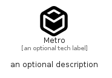

# Metro


```text
simpleicons/M/Metro
```

```text
include('simpleicons/M/Metro')
```


| Illustration | Metro |
| :---: | :---: |
|  |  |


## Sprites
The item provides the following sriptes:

- `<$MetroXs>`
- `<$MetroSm>`
- `<$MetroMd>`
- `<$MetroLg>`


## Metro

### Load remotely
```plantuml
@startuml
' configures the library
!global $LIB_BASE_LOCATION="https://raw.githubusercontent.com/tmorin/plantuml-libs/master/distribution"

' loads the library's bootstrap
!include $LIB_BASE_LOCATION/bootstrap.puml

' loads the package bootstrap
include('simpleicons/bootstrap')

' loads the Item which embeds the element Metro
include('simpleicons/M/Metro')

' renders the element
Metro('Metro', 'Metro', 'an optional tech label', 'an optional description')
@enduml
```

### Load locally
```plantuml
@startuml
' configures the library
!global $INCLUSION_MODE="local"
!global $LIB_BASE_LOCATION="../.."

' loads the library's bootstrap
!include $LIB_BASE_LOCATION/bootstrap.puml

' loads the package bootstrap
include('simpleicons/bootstrap')

' loads the Item which embeds the element Metro
include('simpleicons/M/Metro')

' renders the element
Metro('Metro', 'Metro', 'an optional tech label', 'an optional description')
@enduml
```

