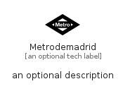

# Metrodemadrid


```text
simpleicons/M/Metrodemadrid
```

```text
include('simpleicons/M/Metrodemadrid')
```


| Illustration | Metrodemadrid |
| :---: | :---: |
|  |  |


## Sprites
The item provides the following sriptes:

- `<$MetrodemadridXs>`
- `<$MetrodemadridSm>`
- `<$MetrodemadridMd>`
- `<$MetrodemadridLg>`


## Metrodemadrid

### Load remotely
```plantuml
@startuml
' configures the library
!global $LIB_BASE_LOCATION="https://raw.githubusercontent.com/tmorin/plantuml-libs/master/distribution"

' loads the library's bootstrap
!include $LIB_BASE_LOCATION/bootstrap.puml

' loads the package bootstrap
include('simpleicons/bootstrap')

' loads the Item which embeds the element Metrodemadrid
include('simpleicons/M/Metrodemadrid')

' renders the element
Metrodemadrid('Metrodemadrid', 'Metrodemadrid', 'an optional tech label', 'an optional description')
@enduml
```

### Load locally
```plantuml
@startuml
' configures the library
!global $INCLUSION_MODE="local"
!global $LIB_BASE_LOCATION="../.."

' loads the library's bootstrap
!include $LIB_BASE_LOCATION/bootstrap.puml

' loads the package bootstrap
include('simpleicons/bootstrap')

' loads the Item which embeds the element Metrodemadrid
include('simpleicons/M/Metrodemadrid')

' renders the element
Metrodemadrid('Metrodemadrid', 'Metrodemadrid', 'an optional tech label', 'an optional description')
@enduml
```

