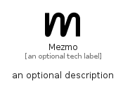

# Mezmo


```text
simpleicons/M/Mezmo
```

```text
include('simpleicons/M/Mezmo')
```


| Illustration | Mezmo |
| :---: | :---: |
|  |  |


## Sprites
The item provides the following sriptes:

- `<$MezmoXs>`
- `<$MezmoSm>`
- `<$MezmoMd>`
- `<$MezmoLg>`


## Mezmo

### Load remotely
```plantuml
@startuml
' configures the library
!global $LIB_BASE_LOCATION="https://raw.githubusercontent.com/tmorin/plantuml-libs/master/distribution"

' loads the library's bootstrap
!include $LIB_BASE_LOCATION/bootstrap.puml

' loads the package bootstrap
include('simpleicons/bootstrap')

' loads the Item which embeds the element Mezmo
include('simpleicons/M/Mezmo')

' renders the element
Mezmo('Mezmo', 'Mezmo', 'an optional tech label', 'an optional description')
@enduml
```

### Load locally
```plantuml
@startuml
' configures the library
!global $INCLUSION_MODE="local"
!global $LIB_BASE_LOCATION="../.."

' loads the library's bootstrap
!include $LIB_BASE_LOCATION/bootstrap.puml

' loads the package bootstrap
include('simpleicons/bootstrap')

' loads the Item which embeds the element Mezmo
include('simpleicons/M/Mezmo')

' renders the element
Mezmo('Mezmo', 'Mezmo', 'an optional tech label', 'an optional description')
@enduml
```

